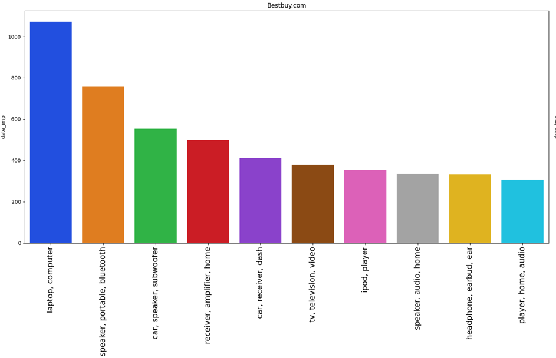
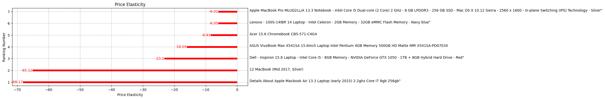

# Price Elasticity applied to Best Buy E-commerce

# Introdução

Esse é um projeto end-to-end de Data Science com modelo de regressão linear aplicada com o intuito de encontrar a elasticidade de preço dos produtos. No qual identificamos a elasticidade de todos os produtos e como a mudança de preços de um produto afetam na categoria. Os resultados podem ser acessadas pelo usuário por meio de um web app [(link)](https://elasticidade-de-preco.streamlit.app), aplicando o desconto no produto e visualizando como isso afeta no faturamento anual da categoria.

Esse projeto faz parte da "Comunidade DS", que é um ambiente de estudo que promove o aprendizado, execução, e discussão de projetos de Data Science.

### Plano de Desenvolvimento do Projeto de Data Science

Esse projeto foi desenvolvido seguindo o método CRISP-DS(Cross-Industry Standard Process - Data Science). Essa é uma metodologia capaz de transformar os dados da empresa em conhecimento e informações que auxiliam na tomada de decisão. A metodologia CRISP-DM define o ciclo de vida do projeto, dividindo-as nas seguintes etapas:

- Entendimento do Problema de Negócio
- Coleção dos Dados
- Limpeza de Dados
- Análise Exploratória dos Dados
- Preparação dos Dados
- Modelos de Machine Learning (Cross-Validation e Fine-Tuning não foram utilizados nesse projeto).
- Avaliação dos Resultados do Modelo e Tradução para Negócio.
- Modelo em Produção

### Planejamento

- [1. Descrição e Problema de Negócio](#1-descrição-e-problema-de-negócio)
- [2. Base de Dados e Premissas de Negócio](#2-base-de-dados-e-premissas-de-negócio)
- [3. Estratégia de Solução](#3-estratégia-de-solução)
- [4. Exploration Data Analysis](#4-exploration-data-analysis)
- [5. Performance da Elasticidade por Produto](#5-performance-da-elasticidade-por-produto)
- [6. Resultados de Negócio](#6-resultados-de-negócio)
- [7. Elasticidade de Preços Cruzada](#7-elasticidade-de-preços-cruzada)
- [8. Modelo em Produção](#8-modelo-em-produção)
- [9. Conclusão](#9-conclusão)
- [10. Aprendizados e Trabalhos Futuros](#10-aprendizados-e-trabalhos-futuros)

# 1. Descrição e Problema de Negócio

### 1.1 Descrição

A elasticidade de preço é uma medida que indica a sensibilidade da demanda de um produto em relação às mudanças no seu preço. Ela é calculada dividindo-se a variação percentual na quantidade demandada pelo produto pela variação percentual no preço do produto.

O conceito de elasticidade de preços visa medir se, por exemplo, o aumento de preços impacta significativamente ou não na demanda do produto. Esse impacto sobre a demanda pode ser classificado como elasticidade de preços elástica, inelástica e unitária. Ainda é possível termos valores negativos representando a elasticidade de preços.

### 1.2 Problema de Negócio

Foi recebido um dataset com dados de vendas de diversos E-commerce, o papel do Cientista de Dados foi:

**- Descobrir qual E-commerce apresenta mais venda e quais categorias se descatam.**

**- Encontrar quais produtos podemos afirmar que há elasticidade de preços.**

**- Encontrar o faturamento anual da categoria após a aplicação da mudança no preço de um produto.**

# 2. Base de Dados e Premissas de Negócio

## 2.1 Base de Dados

O conjunto de dados total possui os seguintes atributos:
| **Atributos** | **Descrição** |
| ------------------- | ------------------- |
| Date_imp_d | Data que a compra foi realizada |
| Category_name | Nome da Categoria |
| name | Nome do produto |
| price | Preço do Produto |
| disc_price | Preço do produto após o desconto aplicado na venda |
| merchant | Identificador do E-commerce |
| Disc_percentage | Percentual de desconto |
| isSale | Indicador se foi venda ou não |
| Imp_count | Contagem de vendas no período |
| brand | Marca |
| p_description | Descrição do produto |
| dateAdded | Data que o produto foi adicionado ao estoque |
| dateSeen | Data que o produto saiu do estoque |
| dateUpdated | Data de atualização da transação |
| manufacturer | Criador do produto |
| Day_n | Dia da semana por escrito |
| month | Mês em número |
| month_n | Mês em escrito |
| day | Dia em número |
| Week_Number | Número da semana |

## 2.2 Premissas de Negócio

Para realizar esse projeto as seguintes premissas de negócio foram adotadas:

- Cada linha é um produto vendido.
- Para garantir uma significância estatística o p valor precisa ser menor que 0,05.
- Produtos que não apresentam significância estatística não terão sua elasticidade de preços considerada nos cálculos do faturamento anual da categoria.
- Para que a reta da regressão linear seja considerada com bom ajuste aos dados ela precisa ter um valor maior que 0,5.

# 3. Estratégia de Solução

A estratégia de solução foi a seguinte:

### Passo 01. Descrição dos Dados

Nesse passo foi verificado alguns aspectos do conjunto de dados, como: nome de colunas, dimensões, tipos de dados, checagem e preenchimento de dados faltantes (NA), análise descritiva dos dados e quais suas variáveis categóricas.

### Passo 02. Análise Exploratória dos Dados (EDA)

Exploração dos Dados com objetivo de encontrar Insights para o melhor entendimento do Negócio.
Foram feitas também análises visando entender mais sobre o dataset e com isso realizar a escolhe de qual E-commerce e categoria de produtos seria utilizado no estudo.

### Passo 03. Featuring Engineering

Na featuring engineering os datasets com os preços e as semanas dos produtos por semana foi pivotado, preparando-os para os cálculos.

### Passo 04. Substituindos NAs dos Datasets Pivotados

Nas semanas que não apresentaram vendas dos produtos no dataset de preços o NA foi substituido pela mediana dos preços, pois o produto tinha preço, apenas não foi vendido. No dataset das demanas os NAs foram substituidos por 0, indicando que não foi demanda daquele produto em sua respectiva semana.

### Passo 05. Análise Exploratória dos Dados dos datasets pivotados (EDA)

Exploração dos Dados com objetivo de encontrar relações visuais entre os preços e as demandas dos produtos.

### Passo 06. Aplicação da Regressão Linear

O método de regressão linear foi utilizado com o intuito de identificar qual a elastiidade de preços desses produtos e se a reta encontrada apreenta significância estatística.

### Passo 07. Bussiness Performance

Com os produtos encontrados foram aplicados alguns descontos, observando como a demanda reagiria.

### Passo 08. Elasticidade de Preços Cruzada

Contudo, um produto nunca está sozinho na vitrine. Dessa forma, utilizou-se a elaticidade de preços cruzada para entender como a mudança no preço de cada produto iria impactar na demanda de todos os demais da categoria.

### Passo 09. Deploy do Modelo em Produção

Publicação do modelo em um ambiente de produção em nuvem (Streamlit) para que fosse possível o acesso de pessoas ou serviços para consulta dos resultados e com isso melhorar a decisão de negócio da empresa.

# 4. Exploration Data Analysis

## 4.1 Análise de todos os E-commerces

### O E-commerce com mais vendas foi a Best Buy

### Na Best Buy a categoria mais vendida é composta por Laptops e Computadores

### A marca mais vendida na Best Buy foi a Sony, evidenciando a grande procura por marcas conhecidas na compra de dispositivos eletrônicos.

### Agosto foi o mês com mais vendas no E-commerce Best Buy, sendo o mês de férias escolares no Canadá e Estados Unidos.

## 4.2 Análise dos produtos na categoria escolhida.

Com o intuito de aumentar a quantidade de informações para a realização da regressão linear foi escolhido o E-commerce e seua categoria com mais vendas, sendo a Best Buy na categoria de Laptops e Computadores.

### Relação da mediana do preço de cada produto com a sua demanda.

# 5. Performance da Elasticidade por Produto

Através da regressão linear da relação entre os preços de cada produtos com suas respectivas demandas na semana utilizamos a seguinte fórmula, onde a derivada é substituda pelo coeficiente angular a reta de regressão que melhor se ajusta a esses dados, e P0 e Q0 são as médias do Preço e Demanda respectivamente.

Dessa forma, entre os 39 produtos analisados apenas 7 apresentam significância estatística (P valor menor que 0,05), sendo:

Observamos então que todos esses produtos apresentam elasticidade elástica negativa, ou seja, quando o preço do produto aumenta, a sua demanda tende a cair, onde o inverso também se torna real, aumentando a demanda na queda dos preços.

# 6. Resultados de Negócio

Assim, podemos observar na imagem a seguir uma simulação do comportamento de cada um dis 7 produtos ao receberem um desconto de 5%.

Os produtos _12 MacBook (Mid 2017, Silver)_ e _Details About Apple Macbook Air 13.3 Laptop_ apresentam ganhos significavos, certamente impactados pelo alto valor de suas elasticidade de preço.

Os demais produtos também aumentam suas demandas e geram lucro apesar do desconto aplicado.

# 7. Elasticidade de Preços Cruzada

Contudo, como a mudança do preço desse produto implica na demanda dos demais produtos da mesma categoria? A fórmula a seguir visa explicar isso, realizando uma correlação entre a mudança de preço de um produto (B) e a mudança na demanda de outro produto (A).

Através desses valores podemos simular como seria o comportamento da cateoria inteira caso um desconto fosse aplicado em um produto e quais produtos seriam complementares ou substitutos ao mesmo.

Na imagem a seguir segue um exemplo disso, onde a aplicação criada realiza o cálculo automático de como o faturamento da categoria mudaria com a mudança no preço de um produto específico.

# 8. Modelo em Produção

Com essas consideração uma aplicação foi criada, com as seguintes funcionalidades:

- Calcular a elasticidade de produto escolhido;
- Mostrar se essa elasticidade tem significância estatística;
- Mostrar se a reta de regressão aplicada se ajusta bem aos dados;
- Apresentar o faturamento anual da categoria e como ele se altera com a mudança no preço de um produto;
- Apresentar os produtos que são correspondentes ou substitutos ao escolhido.

A aplicação foi implementada e colocado em produção por meio da cloud Streamlit (https://streamlit.io), que tem como objetivo possibilitar a criação, execução e operação de aplicativos inteiramente localizados em nuvem.

 

Para utilizar basta entrar no [link](https://elasticidade-de-preco.streamlit.app) e escolher o produto.

O resultado do faturamento após o desconto é mostrado ao clicar no checkbox e variar o número da variação percentual a ser aplicada no produto.

# 9. Conclusão

Nesse projeto, foram realizadas todas as etapas necessárias para a implementação de um projeto completo de Data Science em um ambiente de produção. Foi utilizado o método de gerenciamento de projeto chamado CRISP-DM/DS e obteve-se um desempenho satisfatório em compreender a utilização da elasticidade de preço e criar um entregável que disponibilize essas informações de maneira rápida e fácil.

Tendo em vista esses resultados, o projeto alcançou seu objetivo de encontrar uma solução simples e assertiva para apresentar os resultados da elasticidade de preço, disponibilizando um web app no Streamlit que retorna a elasticidade do produto, como a variação no seu preço impacta no faturamento anual da categoria e quais são os produtos substitutos e correspondentes de forma rápida e eficaz.

# 10. Aprendizados e Trabalhos Futuros

**Aprendizados**

- Compreensão e aplicação da elasticidade de preço e elasticidade de preços cruzada.
- Conceitos de criação de uma aplicação no Streamlit que resolva o problema de negócio.

**Trabalhos Futuros**

- Realizar uma EDA mais aprodunda na categoria de Laptops e Computadores da Best Buy.
- Através dessa EDA visar explicar quais são os melhores produtos e procurar indícios que expliquem sua elasticidade de preços.
- Utilizar outras formas de calcular a elasticidade de preços.
- Otimizar o web app de forma de fique mais funcional para seus usuários.
